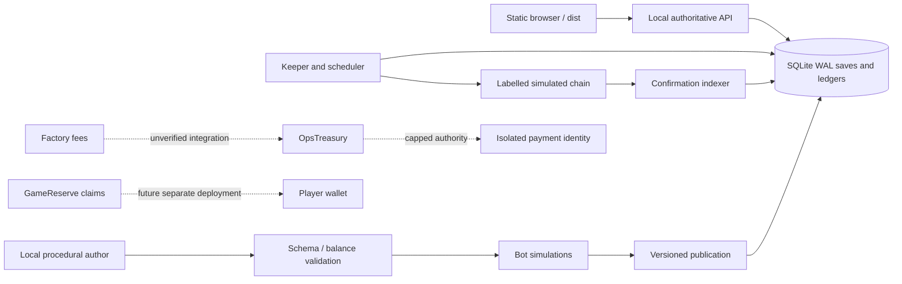

# Architecture and trust boundaries

`server/src/main.js` refuses production mode before loading wallet files. `createApp` accepts only demo SimChain with no contract addresses or paid author. The local HTTP listener binds loopback through `scripts/demo.mjs`. The optional Docker port is also published only on host loopback. No source export contains runtime database files, keys or personal history.

The Node backend uses built-in SQLite and crypto plus repository-owned Ethereum encoding/signature code. No remote dependency resolution is needed. Custom secp256k1/ABI code has known vectors and roundtrip tests but is not an audited signing stack. Real signers are disabled. EOA signatures are supported; EIP-1271 contract wallet verification is an open item.

State-changing moves run in one `BEGIN IMMEDIATE` transaction. Revision checks serialize tabs; an action id maps to its exact request. Invalid moves and failed revives roll back the complete save. Character ownership is checked server-side. Session and recovery values are random and stored hashed. A wallet connection alone creates no session; the signed canonical message binds domain, URI, chain, expiry and a single-use address-bound nonce.

Purchase events credit an order after confirmation depth. Buyers may make gifts; items always go to the server-issued order account. Underpaid or mismatched SKUs produce no item. Order use is scoped to payer onchain to prevent a third party consuming another payer's id with dust. Duplicate paid gifts can still pay twice for one entitlement; do not enable real purchases without signed exact order terms/refund policy. A deep reorg halts settlement, retaining ownership evidence instead of silently replaying on top of consumed items. A shallow reorg drops only uncredited events. SimChain models log reorgs, not complete EVM balance rollback; Foundry tests prove contract behavior separately.

Content is allowlisted data. Nested fields, array sizes, stat magnitudes, tags, event modifiers and text are validated before publication. Regex checks are supplementary; absence of any code-execution or treasury-command path is the primary boundary. Active content is cached by immutable version, never by shared session seed. A rollback stops new use; old versions remain available for existing encounters.

Operating IMD and gas balances belong to OpsTreasury. Player prizes belong to GameReserve, where posted unclaimed amounts are subtracted from spendable free balance. The operations contracts cannot call arbitrary destinations or spend player liabilities. Timelocked payee/route changes remain substantial financial trust: a compromised council can select a malicious route, oracle or payee within deployment-fixed bounds. The token itself has no owner, pause, upgrade or later mint.
